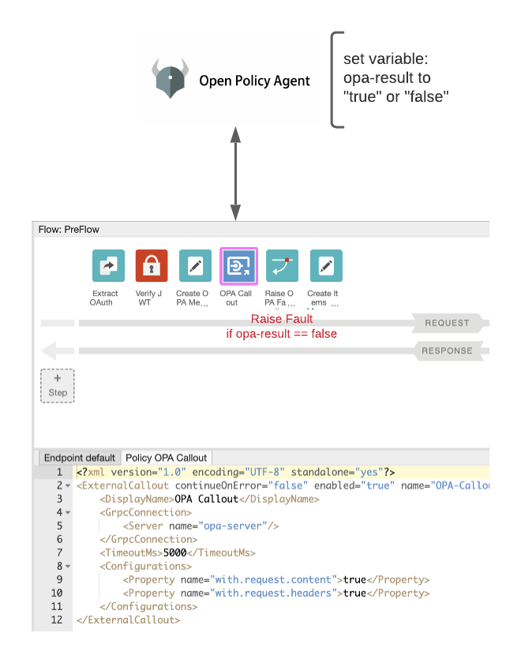

# apigee-opa-callout

This repo shows a sample of how to use the External Callout policy with [Open Policy Agent](https://github.com/open-policy-agent/opa) for Apigee X/hybrid.

## Description

OPA is a general purpose policy engine (aka Policy Decision Point). Apigee's gateway can act as a PEP (policy enforcement point). The common pattern is for Apigee it invoke OPA, let OPA make the allow/deny decision and Apigee enforce the decision.  

Apigee provides a policy called External Callout, which invokes an gRPC server that implements OPA. OPA provides golang [integration](https://github.com/open-policy-agent/opa) which is exposed as a gRPC service. In most cases, OPA provided HTTP API service/server is sufficient. This repo is mostly to show Apigee's External Callout policy with an example.

NOTE:

* OPA supports gRPC via the Envoy ext_authz interface. This was not used because Apigee's External Callout uses an Apigee defined gRPC proto for communication. Apigee's gRPC proto allows the External Callout server to get access to the Apigee Message Context (and manipulate it).

## Example

In this example, Apigee produces a JWT token that looks like:

```json
{
  "aud": "remote-service-client",
  "nbf": 1623366935,
  "developer_email": "apps@sample.com",
  "iss": "xxx",
  "exp": 1623367835,
  "iat": 1623366935,
  "jti": "a406abba-8f3c-434d-978b-d70d2dbf8d68"
}
```

Using Rego, a policy has been authored to grant access to HTTP Methods like this:

```
package httpapi.authz

import input

default allow = false

developers = {
    "apps@sample.com": {
        "/opa/items": {"GET"},
    },
}

allow {
    developers[input.developer_email][input.path][_] = input.method
}
```

This rego allows certain developers (the Apigee entities) access to certain methods. Normally, I would use built-in policies to check such permissions, but for this example we will use OPA.

The external callout service executes the input against the rule and sets a flow variable `opa-result` with the bool `true` or `false`



## Setup

Build and deploy the External callout service

```sh
skaffold run -p gcb --default-repo=gcr.io/xxx -f skaffold-apigee-opa.yaml
```

Deploy the API Proxy included [here](./apiproxy)

___

## Support

This is not an officially supported Google product